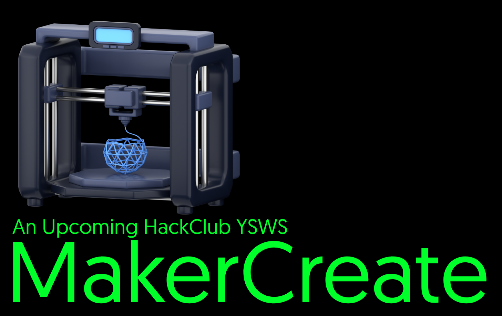

This is the website for MakerCreate, an upcoming HackClub ysws where you make CAD projects for a certain number of hours and get a 3d printer (yours to keep)

## Tech Stack

- React 19
- React Scripts
- Three.js
- @react-three/fiber
- @react-three/drei
- CSS3

## Basic Stuff

- `npm install` to install dependencies
- `npm start` to run the app locally
- `npm run build` to create a production build
- `npm test` to run the test runner

## Project Notes

- The homepage includes an STL viewer powered by `three` and `@react-three/fiber`.
- The UI is styled with custom CSS in `src/App.css`.
- Static assets such as logos, icons, and models live in `public/`.

## Contribution

You can contribute by forking the repository and opening a pull request with your changes. Improvements to the UI, copy, and overall user experience are welcome.
